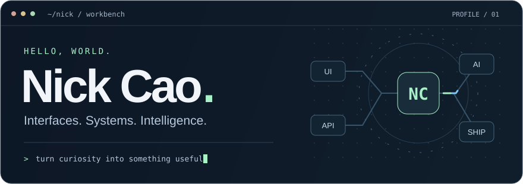

  

<h1 align="center">Hi, I'm Nick </h1>

  <strong>Full-stack developer · AI builder · Curious by default.</strong> 
  I connect thoughtful interfaces, reliable systems, and useful AI. 
  从前端体验，到后端系统，再到 AI 应用，把想法做成能用的产品。

  <a href="https://github.com/rucNick?tab=repositories">Explore my repos ↗</a>
  &nbsp;·&nbsp;
  <a href="https://github.com/rucNick/StreetMed_Website">StreetMed ↗</a>
  &nbsp;·&nbsp;
  <a href="https://github.com/rucNick/CS1653-Group-Project">CypherSpace ↗</a>

### 01 / The toolbox

**Frontend & mobile** 
React · Next.js · TypeScript · Tailwind CSS · Flutter · Dart

**Backend & data** 
Java · Spring Boot · Python · PostgreSQL · Redis · Kafka

**AI engineering** 
Spring AI · MCP · Claude · Gemini · Tool-using agents · Evals

**Cloud & workflow** 
Google Cloud · Docker · GitHub Actions · Linux

### 02 / Things I've built

| Project | What it's about | Stack |
| :--- | :--- | :--- |
| [**StreetMed** ↗](https://github.com/rucNick/StreetMed_Website) | A public website for street medicine. | HTML · CSS · JavaScript |
| [**CypherSpace** ↗](https://github.com/rucNick/CS1653-Group-Project) | A group project exploring encrypted social networking. | React · Node.js · Spring Boot |
| [**Property Data Scraper** ↗](https://github.com/rucNick/Property-Data-Scraper) | Python tools for collecting and searching property records. | Python · Selenium · pandas |

### 03 / A little code, a little play

My contribution graph, with a hungry visitor. 🐍

<picture>
  <source media="(prefers-color-scheme: dark)" srcset="https://raw.githubusercontent.com/rucNick/rucNick/output/github-snake-dark.svg" />
  <source media="(prefers-color-scheme: light)" srcset="https://raw.githubusercontent.com/rucNick/rucNick/output/github-snake.svg" />
  
</picture>

Always learning. Always building. / 保持好奇，持续创造。

