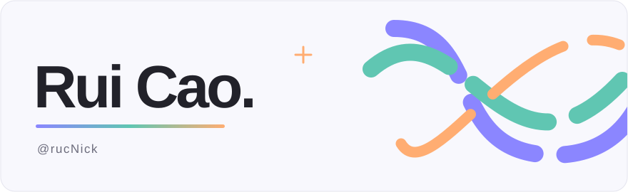
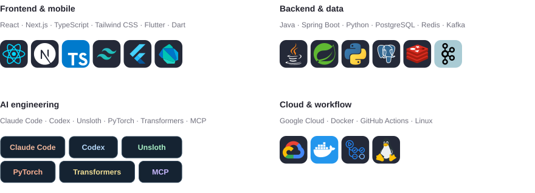

<picture>
  <source media="(prefers-color-scheme: dark)" srcset="./assets/hero-waves-dark.svg" />
  
</picture>

### Tech stack

<picture>
  <source media="(prefers-color-scheme: dark) and (max-width: 700px)" srcset="./assets/stack-mobile-dark.svg" />
  <source media="(prefers-color-scheme: dark)" srcset="./assets/stack-desktop-dark.svg" />
  <source media="(max-width: 700px)" srcset="./assets/stack-mobile-light.svg" />
  
</picture>

### Contribution history

<picture>
  <source media="(prefers-color-scheme: dark)" srcset="https://raw.githubusercontent.com/rucNick/rucNick/output/github-snake-dark.svg" />
  
</picture>
